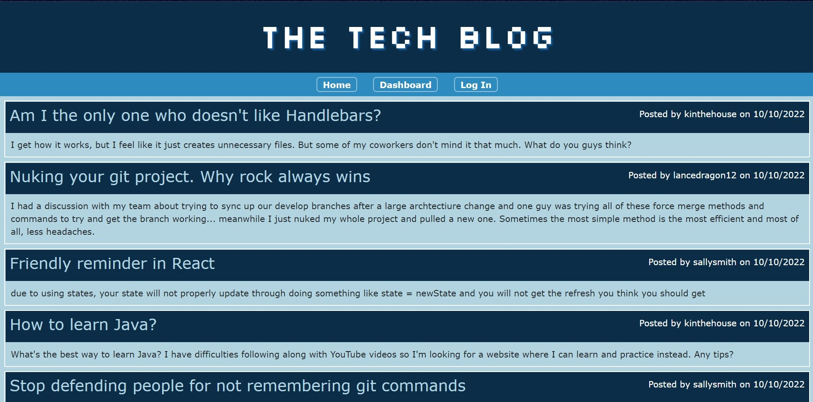
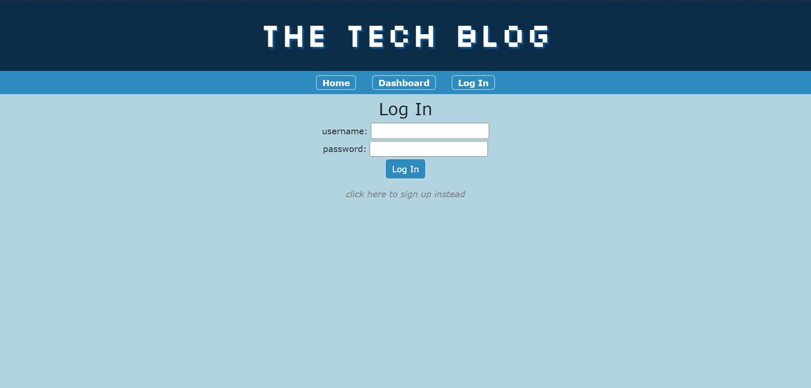
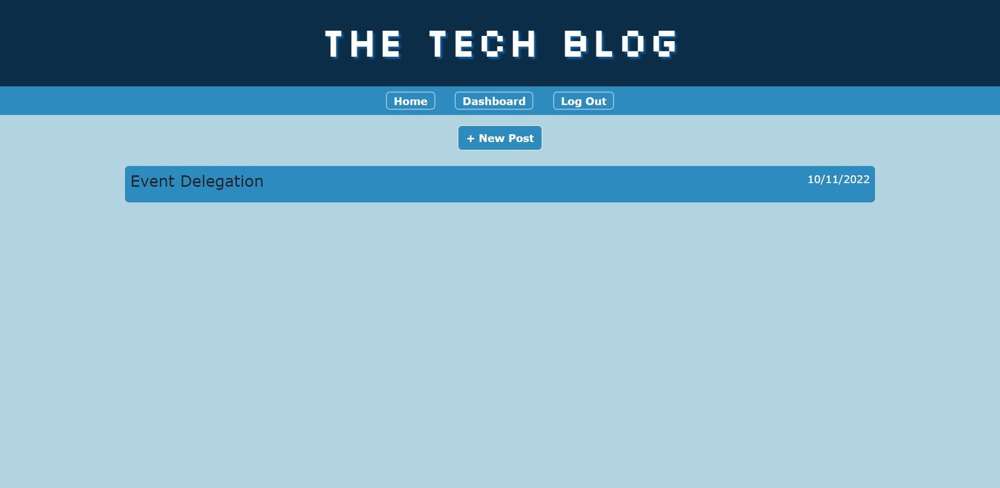
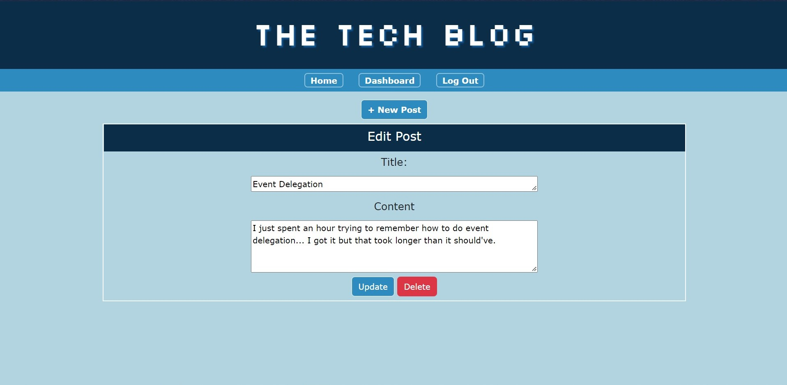
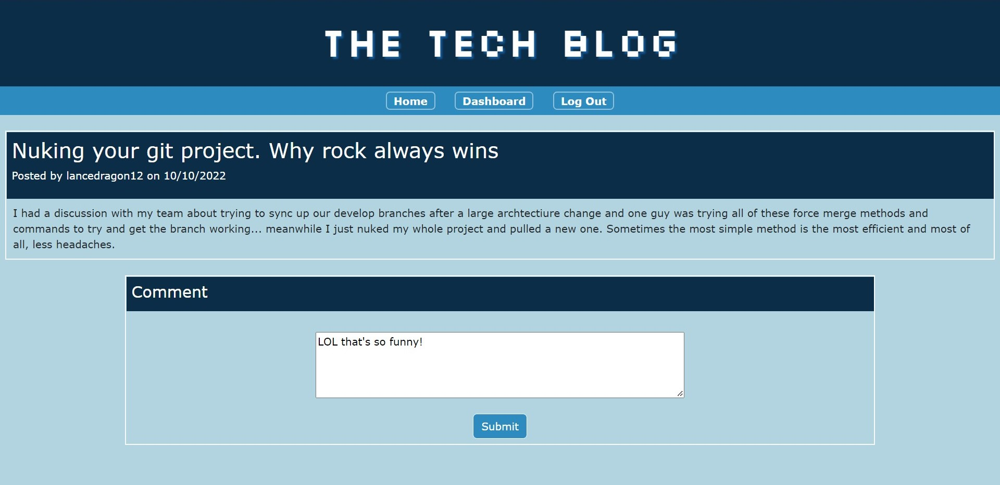

# The Tech Blog

## Description

The tech blog is a website that encourages people of all coding levels to share tips, ask for advice, and leave comments on all sorts of posts! It is an easy to use website that stores data of all the posts created and shows all comments associated with each page.

All a new user has to do is sign up for an account by creating a username and password (at least 8 characters), and that's it! Once logged in, anybody can post or comment. Users also have the option to either update or delete their posts as well.

## Usage

While this website can be accessed by anybody, only logged in users have the full functionality of the site. This includes options to create a post, edit their own posts, delete posts, and view or leave comments on others' posts. If the user doesn't have an account, they can sign up for one! All is needed is a username and password.

Whenever an unregistered or logged out user tries to access a post or dashboard, they will be automatically redirected to the login page. From there, they can log in with their username and password if they have signed up already. A new user can choose the small text on the bottom to switch to the Sign Up form, which allows them to register. Once signed up, the website will keep them logged in until their session ends or if they choose to log out.

The Log In button on the navigation bar will also change into a Log Out button once the website recognizes that the user is logged in!

Logged in users can access their Dashboard from the navigation menu, which is a list of posts they have posted on the site. It shows the title of the post and the date it was posted.

They can choose a specific post to either edit the content, or delete it entirely. When editing, the previous text is filled in already so there's no need to retype everything from scratch! (And yes, event delegation took me longer than it should've to use properly.) If they don't want to edit an existing post, they can always create a new one using the ``+ New Post`` button at the top!

Other users on the site can also post their own tips or rants on the site. A user can choose on a post to comment on it, giving their own advice or just having a small conversation to a post that might've caught their attention. Commenting is as easy as clicking the ``+ Comment`` button and typing in their comment. Once submitted, it will appear on the bottom of the comments list in the specific post it was posted to!

The website will automatically log the user out if they spend more than five minutes logged in.

## Links

Website deployed on Heroku here: 

The GitHub repository is here: [https://github.com/cindyung56/tech-blog](https://github.com/cindyung56/tech-blog)